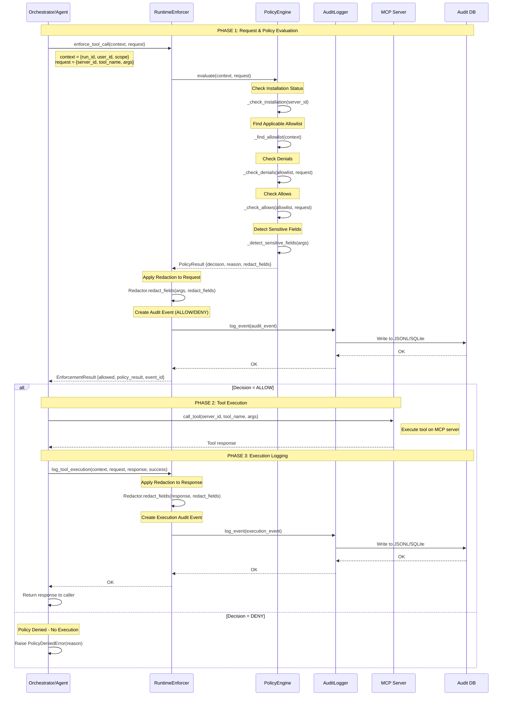

# MCP Tool Call Flow - Sequence Diagram

This document illustrates the complete flow of an MCP tool call through the governance system, from initial request to audit logging.

## High-Level Flow

```
┌─────────────┐                                 ┌──────────────────┐
│             │                                 │                  │
│ Orchestrator│                                 │ Policy Engine    │
│   /Agent    │                                 │                  │
│             │                                 │                  │
└──────┬──────┘                                 └────────┬─────────┘
       │                                                 │
       │  1. Tool Call Request                          │
       ├──────────────────────────────────────────────► │
       │  (server_id, tool_name, args, context)         │
       │                                                 │
       │                                         ┌───────▼────────┐
       │                                         │                │
       │                                         │ Evaluate Policy│
       │                                         │                │
       │                                         └───────┬────────┘
       │                                                 │
       │  2. Policy Decision (allow/deny + reason)      │
       │ ◄──────────────────────────────────────────────┤
       │                                                 │
       │                                         ┌───────▼────────┐
       │                                         │                │
       │                                         │  Audit Logger  │
       │                                         │                │
       │                                         └────────────────┘
       │                                                 
       │  3. Execute Tool (if allowed)                   
       ├─────────────────────────────┐                   
       │                             │                   
       │         ┌───────────────────▼────┐              
       │         │                        │              
       │         │   MCP Server           │              
       │         │   (e.g. filesystem)    │              
       │         │                        │              
       │         └────────────┬───────────┘              
       │                      │                          
       │  4. Tool Response    │                          
       │ ◄────────────────────┘                          
       │                                                 
       │  5. Log Execution                               
       ├────────────────────────────────────────────────►│
       │                                                 │
       │                                         ┌───────▼────────┐
       │                                         │                │
       │                                         │  Audit Event   │
       │                                         │   (JSONL)      │
       │                                         │                │
       │                                         └────────────────┘
       │                                                 
       │  6. Return Response (redacted if needed)        
       │                                                 
       ▼                                                 
```

---

## Detailed Flow with Policy & Audit

### Step-by-Step Sequence



---

## Component Responsibilities

### 1. Orchestrator/Agent
- **Initiates**: Tool call request with full context
- **Enforces**: Calls RuntimeEnforcer before execution
- **Executes**: Only if policy allows
- **Logs**: Reports execution results back to enforcer
- **Example**: LangChain agent, Swarms agent, custom orchestrator

### 2. RuntimeEnforcer
- **Intercepts**: All tool calls before execution
- **Coordinates**: Policy evaluation and audit logging
- **Redacts**: Sensitive data from requests and responses
- **Blocks**: Denied calls from reaching MCP servers
- **Example**: `enforce_tool_call()` must be called before any MCP invocation

### 3. PolicyEngine
- **Evaluates**: Whether a tool call should be allowed
- **Checks**: Installation status, allowlists, denials
- **Detects**: Sensitive data patterns
- **Decides**: Allow/deny with human-readable reason
- **Default**: Deny (fail-secure)

### 4. AuditLogger
- **Records**: All policy decisions and executions
- **Persists**: Events to durable storage (JSONL/SQLite)
- **Enables**: Security analysis, compliance reporting, debugging
- **Redacts**: Sensitive data before logging

### 5. MCP Server
- **Executes**: Tool functionality (only if allowed by policy)
- **Returns**: Tool response to orchestrator
- **Examples**: local-filesystem, stagehand-browser, postgres-sql

### 6. Audit DB
- **Stores**: Audit events in queryable format
- **Supports**: Time-range queries, filtering by run/user/server
- **Provides**: Compliance and security audit trail

---

## Policy Evaluation Details

### Input: RunContext

```python
RunContext(
    run_id="run-abc123",
    job_id=None,
    user_id="admin",
    scope_type="run",
    scope_id="run-abc123",
    agent_id="researcher",
    metadata={}
)
```

### Input: ToolCallRequest

```python
ToolCallRequest(
    server_id="local-filesystem",
    tool_name="read_file",
    arguments={"path": "/data/config.json"},
    server_capabilities=["filesystem", "search"],
    metadata={}
)
```

### Processing Steps

1. **Check Installation Status**
   - Query install records
   - Verify status = "enabled"
   - Reason for deny: "Server not installed" or "Server disabled"

2. **Find Applicable Allowlist**
   - Search order: run → job → user → global
   - Check expiration
   - Reason for deny: "No allowlist found for scope"

3. **Check Explicit Denials**
   - Check `denied_servers` list
   - Check `denied_tools` list
   - Reason for deny: "Server/tool explicitly denied"

4. **Check Explicit Allows**
   - Check `allowed_servers` list
   - Check `allowed_collections` list
   - If `allowed_tools` specified, verify tool is in list
   - Reason for deny: "Server/tool not in allowlist"

5. **Detect Sensitive Fields**
   - Scan argument keys for patterns: api_key, secret, password, token, credential
   - Mark fields for redaction
   - Apply redaction method (mask, hash, remove, partial)

### Output: PolicyResult

```python
PolicyResult(
    decision=PolicyDecision.ALLOW,
    reason="Server 'local-filesystem' is in allowed_servers",
    policy_name="default",
    redact_request_fields=[],
    redact_response_fields=[],
    redaction_method=RedactionDirective.MASK,
    matched_allowlist="990e8400-e29b-41d4-a716-446655440004",
    matched_rule="allowed_servers",
    risk_score=0.1
)
```

---

## Audit Event Schema

### Policy Decision Event

```json
{
  "event_id": "aa0e8400-e29b-41d4-a716-446655440005",
  "event_type": "tool.call.allowed",
  "timestamp": "2026-02-03T03:47:33.537Z",
  "run_id": "run-abc123",
  "job_id": null,
  "user_id": "admin",
  "server_id": "local-filesystem",
  "tool_name": "read_file",
  "decision": "allow",
  "reason": "Server 'local-filesystem' is in allowed_servers",
  "policy_name": "default",
  "request_payload": {
    "path": "/data/config.json"
  },
  "response_payload": null,
  "redacted_fields": [],
  "duration_ms": 2.5,
  "metadata": {
    "matched_allowlist": "990e8400-e29b-41d4-a716-446655440004",
    "matched_rule": "allowed_servers",
    "risk_score": 0.1
  },
  "tags": []
}
```

### Tool Execution Event

```json
{
  "event_id": "bb0e8400-e29b-41d4-a716-446655440006",
  "event_type": "tool.call.executed",
  "timestamp": "2026-02-03T03:47:34.125Z",
  "run_id": "run-abc123",
  "job_id": null,
  "user_id": "admin",
  "server_id": "local-filesystem",
  "tool_name": "read_file",
  "decision": "allow",
  "reason": "Execution completed",
  "policy_name": "default",
  "request_payload": null,
  "response_payload": {
    "content": "...",
    "size": 1024
  },
  "redacted_fields": [],
  "duration_ms": 125.8,
  "metadata": {
    "enforcement_event_id": "aa0e8400-e29b-41d4-a716-446655440005",
    "success": true
  },
  "tags": []
}
```

---

## Redaction Rules

### Default Redaction Patterns

Fields matching these patterns are automatically redacted:

- `api[_-]?key`
- `secret`
- `password`
- `token`
- `credential`
- `auth`
- `bearer`

### Redaction Methods

| Method | Description | Example |
|--------|-------------|---------|
| `mask` | Replace with asterisks | `sk-1234567890` → `***REDACTED***` |
| `hash` | One-way hash (first 16 chars) | `sk-1234567890` → `a1b2c3d4e5f6g7h8` |
| `remove` | Remove field entirely | Field not present in logged payload |
| `partial` | Show first/last chars | `sk-1234567890` → `sk***90` |

### Example: Redacted Request

**Original**:
```json
{
  "api_key": "sk-1234567890abcdef",
  "query": "list files"
}
```

**Redacted** (mask):
```json
{
  "api_key": "***REDACTED***",
  "query": "list files"
}
```

**Audit Event**:
```json
{
  "request_payload": {
    "api_key": "***REDACTED***",
    "query": "list files"
  },
  "redacted_fields": ["api_key"]
}
```

---

## Integration Points in Existing Stack

### Where to Integrate

Based on ARCHITECTURE_FACTS.md, the integration points are:

#### 1. FastAPI Backend (`app.py`)

Add MCP governance routes:

```python
from mcp_governance.api_routes import router as mcp_router

app.include_router(mcp_router)
```

#### 2. Orchestrator Module

Before any MCP tool call:

```python
from mcp_governance.runtime_enforcer import create_runtime_enforcer
from mcp_governance.policy_engine import DefaultPolicyEngine, RunContext, ToolCallRequest

# Initialize
policy_engine = DefaultPolicyEngine(install_records, allowlists, collections)
enforcer = create_runtime_enforcer(policy_engine)

# Before tool call
context = RunContext(run_id=run_id, user_id=user_id, scope_type="run", scope_id=run_id)
request = ToolCallRequest(
    server_id="local-filesystem",
    tool_name="read_file",
    arguments={"path": "/data/config.json"}
)

enforcement_result = enforcer.enforce_tool_call(context, request)

if enforcement_result.allowed:
    # Execute MCP tool
    response = mcp_client.call_tool(...)
    # Log execution
    enforcer.log_tool_execution(context, request, response, success=True, duration_ms=125)
else:
    raise PolicyDeniedError(enforcement_result.policy_result.reason)
```

#### 3. Swarms MCP Integration (`scripts/swarms/examples/mcp/`)

Add enforcement wrapper around existing MCP client calls.

#### 4. Audit Storage

- **JSONL**: `/data/audit/mcp_audit.jsonl` (follows orchestrator_logger.py pattern)
- **SQLite**: `/data/audit/mcp_governance.db` (optional, for complex queries)
- **Integration**: Query audit logs via `/api/mcp/audit/query` endpoint

---

## Error Handling & Fail-Secure

### Policy Enforcement Errors

If policy evaluation fails (e.g., exception thrown), the system **fails secure**:

1. Log error audit event with `decision="deny"`
2. Raise `EnforcementError`
3. Block tool execution
4. Return clear error message to caller

**Example**:
```python
try:
    enforcement_result = enforcer.enforce_tool_call(context, request)
except EnforcementError as e:
    # Policy system is broken - deny for security
    logger.error(f"Policy enforcement failed: {e}")
    raise PolicyDeniedError("Policy system unavailable - access denied for security")
```

### Audit Logging Failures

If audit logging fails, the system **continues execution** but logs the failure:

1. Log error to application log
2. Continue with tool execution (if allowed)
3. Alert admin (optional - via monitoring)

**Rationale**: Logging failures shouldn't break core functionality, but should be monitored.

---

## Performance Considerations

### Expected Latency

| Operation | Expected Time |
|-----------|---------------|
| Policy evaluation | < 5ms |
| Audit event write (JSONL) | < 2ms |
| Full enforcement check | < 10ms |
| Tool execution | 50-500ms (depends on tool) |

### Optimization Strategies

1. **In-memory caching**: Cache allowlists and install records in memory, refresh periodically
2. **Async logging**: Write audit events asynchronously (fire-and-forget)
3. **Connection pooling**: Reuse MCP server connections
4. **Lazy loading**: Load collections only when referenced by allowlist

---

## Security & Compliance

### Compliance Features

- **Audit Trail**: Every policy decision and tool call is logged
- **Redaction**: Sensitive data is masked before logging
- **Least Privilege**: Deny by default, explicit allow required
- **Time-bound Access**: Allowlists can expire
- **Scope Isolation**: Run-level allowlists prevent cross-contamination

### Security Best Practices

1. **Review allowlists regularly**: Ensure least privilege
2. **Monitor denied calls**: High denial rate may indicate misconfiguration or attack
3. **Rotate sensitive credentials**: Don't hardcode in tool arguments
4. **Audit log retention**: Keep logs for compliance period (e.g., 90 days)
5. **Encrypt audit logs**: Protect sensitive audit data at rest

---

## Summary

The MCP governance system provides a **defense-in-depth** approach to tool call security:

1. **Policy Engine**: Evaluates and denies unauthorized calls
2. **Runtime Enforcer**: Blocks denied calls from executing
3. **Audit Logger**: Records all decisions for compliance and debugging
4. **Redaction**: Protects sensitive data in logs
5. **Fail-Secure**: Denies access on policy errors

This design ensures that MCP tool calls are **secure by default**, **auditable**, and **compliant** with enterprise security requirements.
