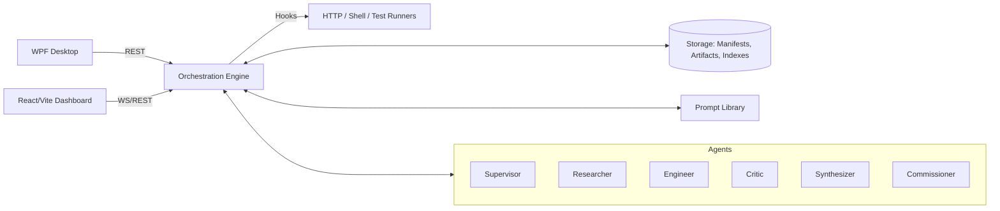

# AI Orchestrator

A multi‑agent orchestration platform with a cross‑model **AI Refiner**, dynamic agent routing, rigorous telemetry, and continuous learning. This README captures the architecture, current capabilities, and a delivery checklist to keep the team aligned.

---

## 1) High-Level Overview
- **Mission:** Turn messy, real‑world tasks into repeatable flows that mix multiple AI agents, tools, and models—safely and audibly.
- **Core Loop:** _Prompt → Refine → Execute → Review → Synthesize → Deliver_ with Supervisor feedback and artifact provenance at each step.
- **Backends:** Model‑agnostic (OpenAI, Gemini, local). Tool‑agnostic (HTTP, shell, file, test runners).
- **UIs:** WPF Desktop Runner (control plane), React/Vite Web Dashboard (observability + history + editor).


## 2) Architecture Diagram (text)
```
+----------------------+         +------------------+         +------------------+
|  Desktop Runner      |  REST   |  Orchestration   |  Hooks  |  Tools / Runtimes|
|  (WPF, tray mode)    +-------->+  Engine          +<------->+  HTTP | Shell    |
|  Start/Pause/Export  |         |  (Flows, Agents) |         |  Test | File I/O  |
+----------+-----------+         +----+----+--------+         +------------------+
           |                           |    |
           | WebSocket/REST            |    | Manifests/Artifacts
           v                           v    v
+--------------------+         +---------------------+     +----------------------+
| React/Vite Dash    |         | Storage & Registry  |     | Prompt Library       |
| Live Runboard      |<------->| (SQLite/FS/Cloud)   |     | (YAML/JSON + tests)  |
| Compare & History  |         | Manifests, Artifacts|     | Lint, search, presets|
+--------------------+         +---------------------+     +----------------------+
```


## 3) Mermaid (optional)



## 4) Key Capabilities (current)
- **Dynamic Agent Routing:** Runtime selection based on task tags, cost/latency, and recent quality signals.
- **AI Refiner:** Restates tasks, injects constraints/schemas, then triangulates across models before finalizing.
- **Agent Telemetry:** Pre‑flight plan, live runboard (queued/running/success/fail), and post‑run dossiers.
- **Provenance & Audit:** Run manifests, artifact registry (with hashes), redaction policy, searchable history.
- **Learning Loop:** Supervisor scoring + notes feed an outcome‑weighted memory that boosts good patterns.
- **Prompt Library:** YAML/JSON prompts with typed I/O; linting, golden tests, and model regression checks.
- **Resumable Runs:** Checkpoints per step; deterministic settings for reproducibility when needed.
- **WSL/Windows/Linux aware:** Path normalization, safe work dirs, and guarded tool invocation.


## 5) Agent Catalog (baseline)
- **Supervisor:** Scores quality, issues corrective guidance, promotes durable insights to global memory.
- **Researcher:** Finds context, requirements, comparable patterns.
- **Engineer:** Produces code/config/artifacts; integrates tools and tests.
- **Critic:** Reviews for defects, risks, and adherence to specs/schemas.
- **Synthesizer:** Merges variants, resolves contradictions, prepares consumable outputs.
- **Commissioner:** Assesses real‑world value, cost/latency, and recommends go/no‑go.


## 6) Storage, Manifests, and Audit
- **Run Manifests:** Timestamped JSON; repo context, agents/models, inputs/outputs, artifacts, and costs.
- **Artifact Registry:** SHA256 + lineage (agent → step → params). Exportable bundle for handoff.
- **Indexes:** Query by division/project/run; filter by model mix, errors, and KPIs.


## 7) Telemetry & Reporting
- **Pre‑Flight Board:** Which agents will be used, model versions, estimated tokens/cost.
- **Live Runboard:** Real‑time state per step with partial outputs (redacted where needed).
- **Post‑Run Dossier:** Token/cost/latency, error taxonomy, quality metrics, artifact lineage.
- **Diffs:** Compare runs or agent configs; see why quality or cost changed.


## 8) Continuous Learning
- **Outcome‑Weighted Memory:** Elevate successful prompts/tool choices; down‑rank poor performers.
- **Feedback Paths:** Supervisor notes → agent hints/presets → future routing.
- **Pattern Mining:** Auto‑suggest reusable prompt modules and typed templates.


## 9) Prompt Library Spec
- **Schema:** name, role, inputs, outputs, constraints, examples, tests.
- **Validation:** Lint + schema check in CI; golden outputs per model/version.
- **Surfacing:** Search by tag/domain/agent; quick‑insert into pre‑flight.


## 10) UI Surfaces
- **WPF Desktop Runner:** Start/pause/resume, edit agents, export dossiers, tray mode.
- **React/Vite Dashboard:** Live telemetry, history browser, agent editor, compare runs, JSON/Markdown viewers.


## 11) Reliability & Cost Controls
- **Budgets:** Time/cost guardrails; graceful degrade to cheaper models; context summarization.
- **Checkpoints:** Restart from last good step; deterministic seeds for reproducibility.
- **Contracts:** Inter‑agent JSON schemas with strict validation.


## 12) Tooling & Extensibility
- **Adapters:** HTTP, shell, file I/O, code linters/test runners.
- **Hooks:** Before/after step notifications, exports, custom validators.
- **Environments:** Windows/WSL/Linux friendly execution.


## 13) Getting Started (local dev)
1. Clone repository and set required API keys as environment variables.
2. Start the Desktop Runner.
   - Example (PowerShell):
     ```powershell
     # Launch WPF runner (example script name)
     ./Start-OrchestratorDesktop.ps1
     ```
3. Start the local API / engine service (if separate):
   ```powershell
   ./Start-OrchestratorEngine.ps1 -Port 6060
   ```
4. Open the React dashboard (dev server):
   ```powershell
   cd ./dashboard
   npm install
   npm run dev
   ```


## 14) Configuration (as code)
- **agents/**: role presets, capability tags, model pins.
- **prompts/**: YAML/JSON prompt specs + tests.
- **policies/**: redaction rules, PII checks, governance packs.
- **engine.config.json**: ports, storage paths, budgets.


## 15) CI / Quality Gates
- Prompt lint & schema validation.
- Unit tests for adapters and flow contracts.
- Sample flow smoke tests across PowerShell 5.1 & 7+ (and other runtimes where applicable).


## 16) Roadmap (near‑term)
- Bandit‑style agent selection by KPI (A/B and Thompson sampling).
- Policy packs per project (PII/PHI/secrets) with auto‑redaction previews.
- First‑class code runner/test runner with coverage reports and artifact links.
- Team mode (RBAC), shared presets, approvals, and run annotations.


---

# Delivery Checklist (living)

> Use this to track readiness for demos and production pilots. Mark with ✅/🟡/❌.

## Core Engine
- [ ] Flow runner with checkpoints
- [ ] Dynamic agent routing (tags, cost, latency)
- [ ] Uniform envelope for model calls
- [ ] Error taxonomy + retry/backoff

## AI Refiner
- [ ] Restatement + constraint injection
- [ ] Cross‑model critique/merge
- [ ] Environment‑aware output adapters

## Agents
- [ ] Catalog presets (Supervisor/Researcher/Engineer/Critic/Synthesizer/Commissioner)
- [ ] Per‑run overrides; org presets
- [ ] Mid‑run hot‑swap & staging

## Telemetry & Reporting
- [ ] Pre‑flight board (planned agents/models, budget)
- [ ] Live runboard with partial outputs
- [ ] Post‑run dossier (costs, latency, lineage)
- [ ] Config diffing between runs

## Learning
- [ ] Supervisor scoring pipeline
- [ ] Outcome‑weighted memory store
- [ ] Pattern mining → prompt modules

## Prompt Library
- [ ] YAML/JSON spec + schemas
- [ ] Lint + golden tests in CI
- [ ] Search/tags + quick insert

## Storage & Audit
- [ ] Run manifests (timestamped JSON)
- [ ] Artifact registry (hash + lineage)
- [ ] Redaction policies + logs
- [ ] Queryable history (filters)

## UI
- [ ] WPF Desktop Runner (tray mode)
- [ ] React/Vite Dashboard (history, compare)
- [ ] Inline diff/JSON/Markdown viewers

## Reliability & Cost
- [ ] Time/cost budgets + degrade path
- [ ] Deterministic modes
- [ ] Contract schemas (strict)

## Tooling & Extensibility
- [ ] HTTP/shell/test adapters
- [ ] Before/after hooks
- [ ] Windows/WSL/Linux execution paths

## CI / DevX
- [ ] One‑command launch scripts
- [ ] Cross‑runtime smoke tests
- [ ] PR checks for prompt & policy changes


---

## Glossary
- **Run:** One end‑to‑end orchestration execution.
- **Agent:** Role with a prompt kit and model pin(s).
- **Artifact:** Any generated file or structured result with provenance.
- **Manifest:** JSON ledger describing a run (agents, steps, costs, outputs).


## Contributing
- Open a PR with a short description, screenshots (or run manifest), and updated checklist marks.
- Keep prompts/test assets small and deterministic; add golden outputs when feasible.


## License
- T.B.D. per organization policy.

